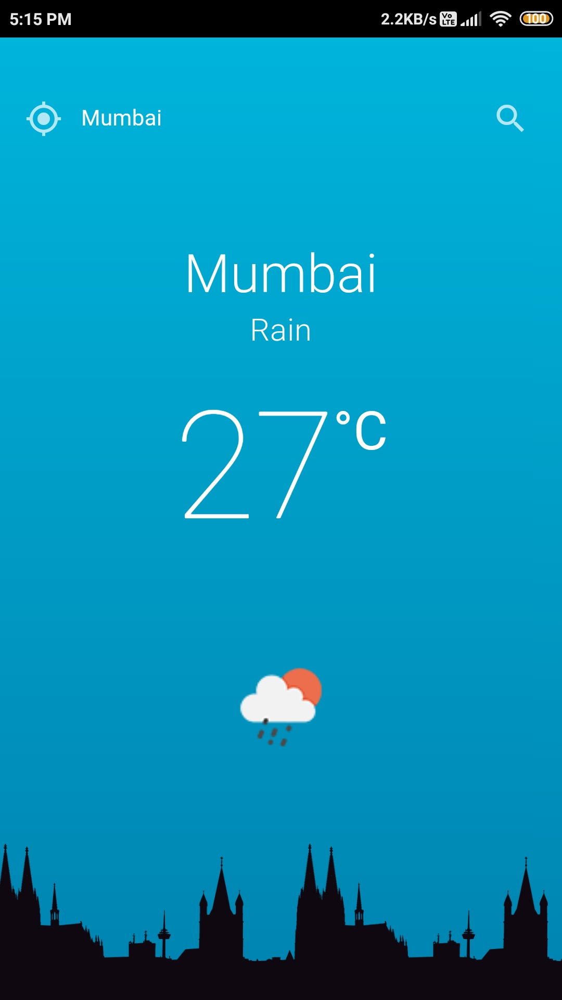

# Quasar Weather App (quasar-weather)

A Cross Platform Quasar Framework Weather app made using UI design with VueJS. <br />
It can be written 1 time and can be built for all 5 platforms, Windows,Mac,Android,iOS and Browser for deployment at the same time. <br />
Here the app is only built by me for Android as apk file : https://github.com/HoneyBerman/quasar_weather/blob/master/src-cordova/MyweatherByHoney.apk and for browser as App.Vue file which can be used with suitable extensions. <br />
Below is a  working screenshot .<br />



## Install the dependencies
```bash
npm install
```

### Start the app in development mode (hot-code reloading, error reporting, etc.)
```bash
quasar dev
```


### Build the app for production
```bash
quasar build
```

### Customize the configuration
See [Configuring quasar.conf.js](https://quasar.dev/quasar-cli/quasar-conf-js).
